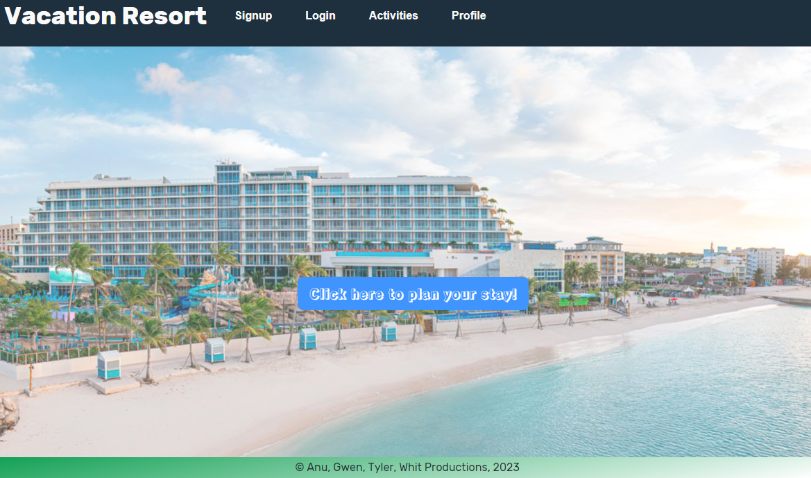

# dreamvacation
Stay at our resort and select your activities to make this the vactation of your dreams

 []
 
 ## Description:
 This application allows users to plan their activities at our fabulous resort! We used React for the front end, and GraphQL with a Node.js and Express.js server. The database is MongoDB and the Mongoose ODM. We used queries and mutations for retrieving, adding, updating, and deleting data. The site is deployed to heroku. (see link at bottom of README)

## Contents
  
  
  2. [Installation](#installation)
  
  3. [Usage](#usage)
  
  4. [Contributing](#contributing)
  
  5. [Tests](#tests)
  
  
## Installation:
  
  clone the repository
  
  ---
  
## Usage:
 
 To utilize the vacation planner: Go to VScode. Run"npm start" in the client directory and in a second terminal run "npm run production" in the server directory. React will open your browser to a tab with the deployed application.

  ---
 
  ## License
  
  License used for this project - MIT
  [![License: MIT]](https://opensource.org/licenses/MIT)
  
  ---
  
  ## Contributing:
  
  Please follow these instructions to contribute to the project:
  create pull request from seperate branch and await approval
  
  ---
  
  ## Tests:
  
   `npm test` Launches the test runner in the interactive watch mode.\
    See the section about [running tests](https://facebook.github.io/create-react-app/docs/running-tests) for more information.

  
  ---
  
 ## Credits:
Development Team: Anu Khadka, Gwen Paradis, Tyler Powers, Whit Spaulding. Thank you to our Instructors and class mates for their assistance throughout this process.

  ---

  ## Questions
  
  * GitHub Username: gwenparadis
  * Link to Github user profile: github.com/gwenparadis
  * Development Team Email Addresses: 
 anuragi.khadka@gmail.com, gwendelynparadis2@gmail.com, tylerpowerst@aol.com,whitspa64@duck.com

## Link to github repository
https://github.com/gwenparadis/vacation-planner

## Link to the deployed application
https://
  
 
  A screen shot of the application is below:

© 2023 Anu Gwen Tyler Whit Productions. Confidential and Proprietary. All Rights Reserved.

